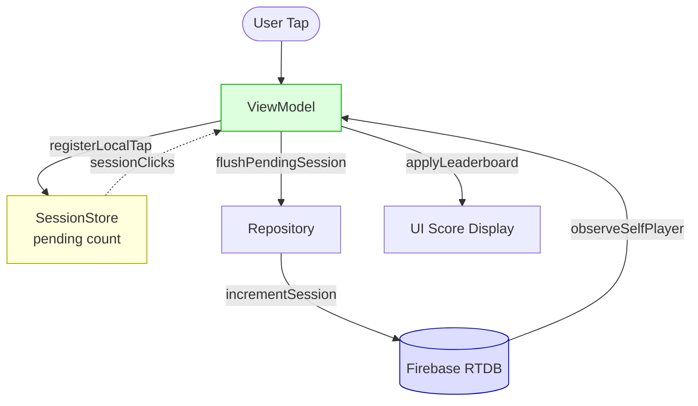
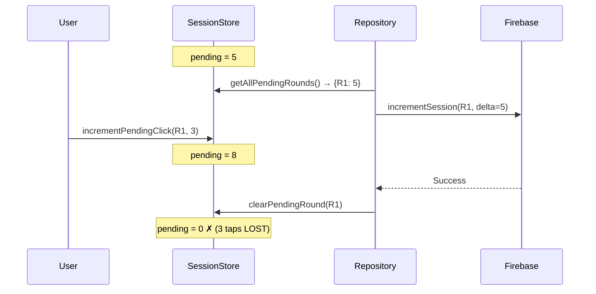
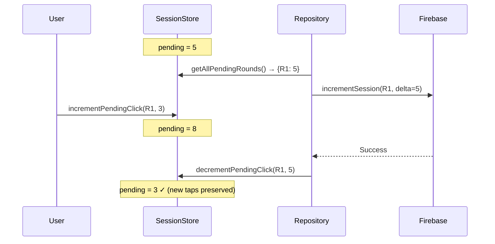
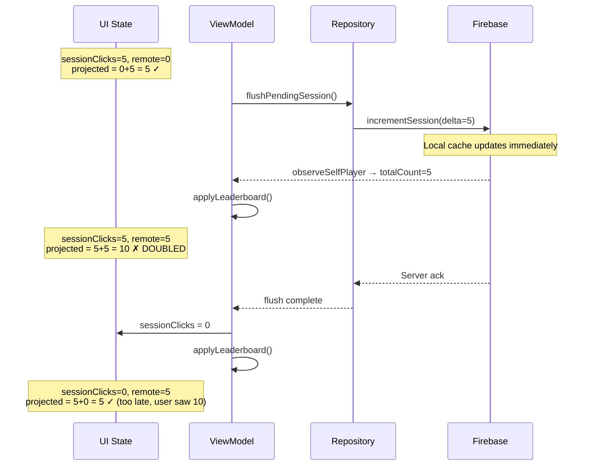
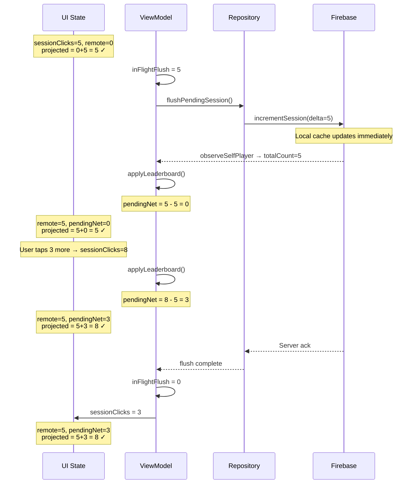

# Score Reliability Fixes

## Architecture Overview



The two race conditions occur at the boundaries between these components — one between Store and Repository (score lost), and one between Firebase observer and ViewModel state (score doubled).

## Problem

Two race conditions caused unreliable score display:
1. **Score lost** — taps added during a network flush were wiped out
2. **Score doubled** — UI showed remote + local count during the flush-to-ack window

## Root Cause 1: Score Lost (Flush Wipes Concurrent Taps)

`flushPendingSession()` called `clearPendingRound(roundKey)` on success, which deleted ALL pending taps — including ones the user added while the network call was in flight.

**Timeline:**
```
User has 5 pending taps
flushPendingSession() snapshots count=5, starts network call
User taps 3 more → pending=8
Network returns success → clearPendingRound() → pending=0  ← 3 taps LOST
```

**Sequence diagram (before fix):**


**Sequence diagram (after fix):**


**Fix:** Replace `clearPendingRound()` with `decrementPendingClick(roundKey, count)` which only subtracts the snapshotted amount:
```kotlin
// Before (broken)
result.onSuccess { sessionStore.clearPendingRound(roundKey) }

// After (fixed)
result.onSuccess { sessionStore.decrementPendingClick(roundKey, count) }
```

## Root Cause 2: Score Doubled (Projection Race)

`applyLeaderboard()` computed: `selfProjectedTotal = selfRemoteTotal + sessionClicks`

When Firebase's local cache fires `observeSelfPlayer` (reflecting the flushed increment) BEFORE the ViewModel resets `sessionClicks`, both values are non-zero:

**Timeline:**
```
sessionClicks=5, remote=0 → projected=5 ✓
flush starts, incrementSession fires
Firebase local cache updates → observeSelfPlayer emits totalCount=5
applyLeaderboard() → 5 + 5 = 10 ← DOUBLED
flush completes → sessionClicks=0, remote=5 → projected=5 ✓ (too late)
```

**Sequence diagram (before fix — score doubles):**


**Sequence diagram (after fix — inFlightFlush prevents doubling):**


**Fix:** Track in-flight flush amount and subtract from projection:
```kotlin
// Snapshot before flush
inFlightFlush = state.value.sessionClicks

// In applyLeaderboard, exclude in-flight taps from projection
val pendingNet = (state.value.sessionClicks - inFlightFlush).coerceAtLeast(0)
val selfProjectedTotal = selfRemoteTotal + pendingNet
```

During flush: `pendingNet = 5 - 5 = 0`, so `projected = 5 + 0 = 5` ✓
New taps during flush: `sessionClicks=8, inFlight=5 → pendingNet=3, projected = 5 + 3 = 8` ✓

## Interface Extraction

Extracted `MohamedLoversFirebaseApi` interface from `MohamedLoversFirebaseClient` to enable unit testing without Firebase. DI uses `bind`:
```kotlin
single { MohamedLoversFirebaseClient(get()) } bind MohamedLoversFirebaseApi::class
```

## Test Coverage

- `MohamedLoversSessionStoreTest` — 10 tests covering increment, decrement, concurrent taps, index cleanup
- `MohamedLoversRepositoryFlushTest` — 7 tests covering flush send, clear on success, preserve on failure, concurrent tap preservation, partial multi-round failure, empty pending, auth failure
- `MohamedLoversViewModelProjectionTest` — 1 test verifying projection doesn't double-count when observeSelfPlayer fires during flush
