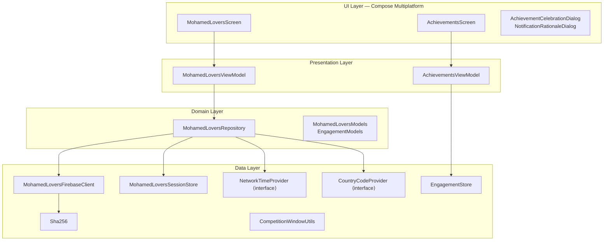
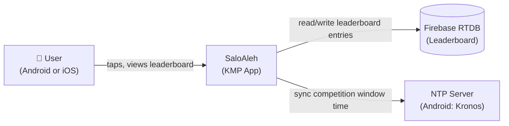
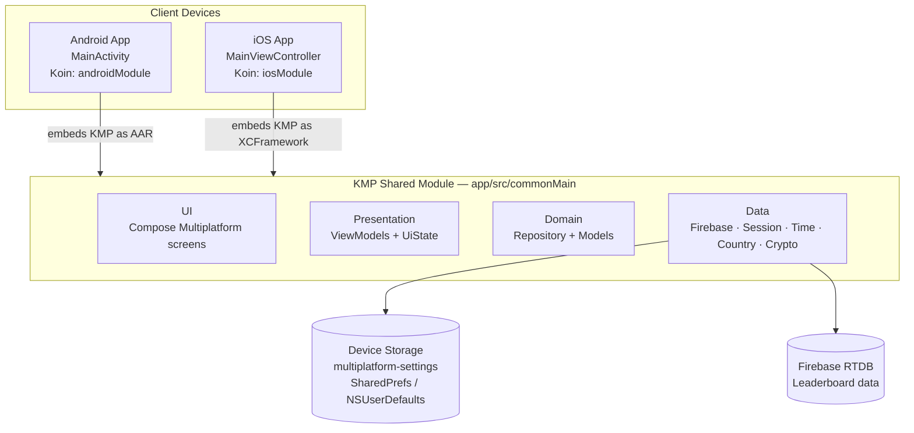
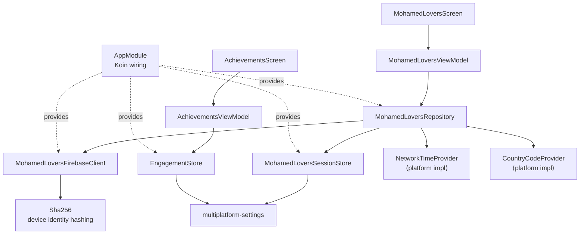

# README Update Implementation Plan

> **For agentic workers:** REQUIRED SUB-SKILL: Use superpowers:subagent-driven-development (recommended) or superpowers:executing-plans to implement this plan task-by-task. Steps use checkbox (`- [ ]`) syntax for tracking.

**Goal:** Rewrite README.md as a complete project landing page with screenshot placeholders, feature list, layered architecture diagram, C4 models (C1/C2/C3), and inline ADRs.

**Architecture:** Single README.md — all content inline, no separate docs files. Mermaid for all diagrams (GitHub renders natively). Screenshot placeholder table with `docs/screenshots/` paths.

**Tech Stack:** Markdown, Mermaid diagrams, GitHub badges.

---

## File Map

| Action | Path |
|--------|------|
| Modify | `README.md` (complete rewrite, keep build/run commands) |
| Create | `docs/screenshots/.gitkeep` |

---

### Task 1: Create screenshots directory

**Files:**
- Create: `docs/screenshots/.gitkeep`

- [ ] **Step 1: Create directory and placeholder file**

```bash
mkdir -p docs/screenshots && touch docs/screenshots/.gitkeep
```

- [ ] **Step 2: Commit**

```bash
git add docs/screenshots/.gitkeep
git commit -m "chore: add screenshots directory for README"
```

---

### Task 2: Write header, badges, screenshots, and features sections

**Files:**
- Modify: `README.md` (replace entire file with new content — start here, more sections added in later tasks)

- [ ] **Step 1: Replace README with header + badges + screenshots + features**

Replace the entire contents of `README.md` with:

```markdown
# SaloAleh

Weekly salawat tap competition — Android & iOS, built with Kotlin Multiplatform.

[](https://github.com/MahmoudMabrok/SaloAleh/actions/workflows/build.yml)


---

## Screenshots

<!-- Replace each placeholder with the actual screenshot once captured.
     Recommended tool: Android Studio (Android) / Xcode simulator (iOS).
     Save files to docs/screenshots/ at the paths shown below. -->

| Screen | Android | iOS |
|--------|---------|-----|
| Main counter | <!-- Replace --> `docs/screenshots/android-main.png` | <!-- Replace --> `docs/screenshots/ios-main.png` |
| Leaderboard sheet | <!-- Replace --> `docs/screenshots/android-leaderboard.png` | <!-- Replace --> `docs/screenshots/ios-leaderboard.png` |
| Achievements | <!-- Replace --> `docs/screenshots/android-achievements.png` | <!-- Replace --> `docs/screenshots/ios-achievements.png` |

---

## Features

### Core

- **Weekly salawat counter** — tap to send salawat, count accumulates for the active competition round
- **Friday bonus** — 2× score multiplier on Fridays (Cairo timezone, `Africa/Cairo`)
- **Competition rounds** — weekly cycles; round resets every Friday at midnight Cairo time; round key format `YYYY-WW`

### Leaderboard

- Top 10 players globally, ranked by score for the current round
- Anonymous display tag: `{COUNTRY} • {last-6-of-hashed-id}` (e.g. `EG • A3F9C2`)
- Country code detected per platform (network SIM → locale fallback on Android; `NSLocale` on iOS)
- Refreshes every 30 minutes (note shown in leaderboard sheet)
- Real-time sync via Firebase Realtime Database

### Achievements

- **Streak badges** — 7-day streak (`STREAK_7`), 30-day streak (`STREAK_30`)
- **Rank badges** — earned for finishing 1st–10th place in a completed round (10 distinct badge assets)
- Achievement celebration dialog shown on first unlock
- Achievements history screen shows all earned badges with earned date

### Engagement

- Daily open streak tracking (increments once per calendar day)
- Notification opt-in with rationale dialog (no forced permission request)

---
```

- [ ] **Step 2: Commit**

```bash
git add README.md
git commit -m "docs: add header, screenshots placeholders, and features to README"
```

---

### Task 3: Add architecture and C4 models sections

**Files:**
- Modify: `README.md` (append two sections before the existing Build & Run content)

- [ ] **Step 1: Append architecture + C4 sections to README**

Open `README.md`. Find the line `## Requirements` (start of old build content). Insert the following two sections immediately before it:

```markdown
## Architecture

SaloAleh uses a strict unidirectional layer dependency: `UI → Presentation → Domain → Data`. Platform-specific behaviour is injected via interfaces (`NetworkTimeProvider`, `CountryCodeProvider`) using Koin DI.



---

## C4 Models

### C1 — System Context



### C2 — Container



### C3 — Component (KMP Shared Module)



---

```

- [ ] **Step 2: Commit**

```bash
git add README.md
git commit -m "docs: add architecture diagram and C4 models to README"
```

---

### Task 4: Add inline ADRs section

**Files:**
- Modify: `README.md` (append ADRs section before `## Requirements`)

- [ ] **Step 1: Append ADRs section to README**

Open `README.md`. Find `## Requirements`. Insert the following section immediately before it:

```markdown
## Architecture Decision Records

Summary of key technical decisions. Each ADR is permanent record — superseded decisions are marked.

---

### ADR-0001 — Kotlin Multiplatform over separate Android and iOS codebases

**Status:** Accepted

**Context:** App targets both Android and iOS. Maintaining two separate codebases doubles logic bugs and diverges UX over time.

**Decision:** Use Kotlin Multiplatform (KMP) with Compose Multiplatform for shared UI. One `app/` module compiles to Android AAR and iOS XCFramework. Platform-specific code limited to `androidMain` / `iosMain` source sets.

**Consequences:** Single source of truth for business logic, UI, and data flow. Trade-off: iOS build requires Xcode + CocoaPods; KMP ecosystem is younger than native iOS tooling.

---

### ADR-0002 — Koin over Hilt for dependency injection

**Status:** Accepted

**Context:** Hilt is Android-only (`javax.inject` annotations, Gradle plugin). KMP shared module cannot depend on Hilt.

**Decision:** Use Koin (`koin-core`, `koin-compose`, `koin-compose-viewmodel`). DI configured in `commonMain/di/AppModule.kt`; platform modules (`androidModule`, `iosModule`) provide platform-specific bindings.

**Consequences:** DI works identically on both platforms. Trade-off: Koin uses runtime resolution (no compile-time verification like Hilt/Dagger).

---

### ADR-0003 — SHA-256 hashed UUID over Firebase Anonymous Authentication

**Status:** Accepted

**Context:** Firebase Anonymous Auth incurs per-user cost at scale and requires network calls at app launch. App needs only a stable anonymous identity for leaderboard entries.

**Decision:** Generate a random UUID on first launch, persist it via `multiplatform-settings`, and SHA-256 hash it (`data/crypto/Sha256.kt`) before sending to Firebase. No Firebase Auth used.

**Consequences:** Zero auth cost. Identity is device-local — uninstall loses it. Leaderboard tag is last-6-chars of hash, so collisions are negligible at current scale.

---

### ADR-0004 — No UseCase layer — Repository as orchestrator

**Status:** Accepted

**Context:** Standard clean architecture adds a UseCase layer between ViewModel and Repository. For this app, the Repository already orchestrates non-trivially: `bootstrap()` merges 4 data sources; `flushPendingSession()` has retry/guard logic.

**Decision:** ViewModel calls Repository directly. Repository is the orchestrator. No UseCase classes.

**Consequences:** Fewer files and less indirection. Trade-off: if use cases multiply, Repository may become a god object — revisit if it exceeds ~300 lines of substantive logic.

---

### ADR-0005 — GitLive Firebase Kotlin SDK over platform-specific Firebase SDKs

**Status:** Accepted

**Context:** Firebase Android SDK and Firebase iOS SDK have different APIs. Using them directly in KMP would require `expect/actual` wrappers for every Firebase call.

**Decision:** Use the GitLive `firebase-kotlin-sdk` (`firebase-database`, `firebase-auth`). It provides a unified Kotlin API over both native SDKs via `expect/actual` internally.

**Consequences:** Firebase calls written once in `commonMain`. Trade-off: GitLive SDK may lag behind Firebase native SDK releases; API surface is smaller than native.

---

### ADR-0006 — multiplatform-settings over direct SharedPreferences / NSUserDefaults

**Status:** Accepted

**Context:** `SharedPreferences` is Android-only; `NSUserDefaults` is iOS-only. Session store and engagement store both need key-value persistence in `commonMain`.

**Decision:** Use Russhwolf `multiplatform-settings` library. Provides a common `Settings` interface backed by `SharedPreferences` on Android and `NSUserDefaults` on iOS.

**Consequences:** Persistence code written once in `commonMain`. No platform-specific storage wrappers needed.

---

```

- [ ] **Step 2: Commit**

```bash
git add README.md
git commit -m "docs: add inline ADRs section to README"
```

---

### Task 5: Update Build & Run and Project Structure sections

**Files:**
- Modify: `README.md` (update existing bottom sections)

- [ ] **Step 1: Replace remaining README content (from `## Requirements` to end)**

Find `## Requirements` in `README.md`. Replace from that line to end-of-file with:

```markdown
## Requirements

| Tool | Version |
|------|---------|
| JDK | 17+ |
| Android SDK | API 24+ |
| Xcode | 15+ (iOS only) |
| CocoaPods | latest (`sudo gem install cocoapods`) |

## Run Android

```bash
# Build debug APK
./gradlew assembleDebug

# Install on connected device / running emulator
adb install app/build/outputs/apk/debug/app-debug.apk

# Or build + install in one step
./gradlew installDebug
```

## Run iOS (Simulator)

```bash
# 1. Build the KMP shared framework
./gradlew :app:linkDebugFrameworkIosSimulatorArm64

# 2. Build the iOS app (uses CocoaPods workspace)
xcodebuild \
  -workspace iosApp/iosApp.xcworkspace \
  -scheme SaloAleh \
  -configuration Debug \
  -derivedDataPath build/ios-dd \
  -destination 'platform=iOS Simulator,name=iPhone 17' \
  build

# 3. Install and launch on the booted simulator
SIMULATOR_ID=$(xcrun simctl list devices booted | grep -m1 iPhone | sed 's/.*(\(.*\)).*/\1/')
APP_PATH=$(find build/ios-dd/Build/Products/Debug-iphonesimulator -name "SaloAleh.app" | head -1)
xcrun simctl install "$SIMULATOR_ID" "$APP_PATH"
xcrun simctl launch "$SIMULATOR_ID" tools.mo3ta.salo
```

## Project Structure

```
SaloAleh/
├── app/                            # KMP shared module (Android + iOS logic + UI)
│   └── src/
│       ├── commonMain/kotlin/tools/mo3ta/salo/
│       │   ├── data/
│       │   │   ├── country/        # CountryCodeProvider interface
│       │   │   ├── crypto/         # Sha256 (device identity)
│       │   │   ├── engagement/     # EngagementStore (streaks, open count)
│       │   │   ├── firebase/       # MohamedLoversFirebaseClient
│       │   │   ├── session/        # MohamedLoversSessionStore (pending taps)
│       │   │   └── time/           # NetworkTimeProvider interface + CompetitionWindowUtils
│       │   ├── domain/             # MohamedLoversRepository, Models
│       │   ├── presentation/       # MohamedLoversViewModel, AchievementsViewModel, UiState
│       │   ├── ui/                 # Compose screens and components
│       │   │   └── components/     # InfoSheet, Counter, SkyBackground, Palette, Fonts…
│       │   ├── analytics/          # AnalyticsManager interface + NoOp impl
│       │   ├── di/                 # AppModule (Koin)
│       │   └── App.kt              # Compose entry point
│       ├── androidMain/kotlin/     # Android impls: KronosNetworkTimeProvider, AndroidCountryCodeProvider
│       └── iosMain/kotlin/         # iOS impls: IosNetworkTimeProvider, IosCountryCodeProvider
├── iosApp/                         # Native Swift iOS shell (AppDelegate, CocoaPods workspace)
├── docs/
│   ├── screenshots/                # Drop screenshot files here (see Screenshots section)
│   └── superpowers/specs+plans/    # Design specs and implementation plans
├── scripts/                        # CI and leaderboard scripts
└── .github/workflows/
    ├── build.yml                   # Android + KMP build CI
    ├── deploy.yml                  # Release deploy
    └── leaderboard-populate.yml    # Scheduled leaderboard population
```
```

- [ ] **Step 2: Verify README renders correctly**

Open `README.md` in a Markdown previewer (VS Code: `Cmd+Shift+V`, or push and view on GitHub). Check:
- Mermaid diagrams render (3 C4 diagrams + 1 architecture diagram)
- Badge URLs point to correct workflow names (`build.yml`)
- Screenshot table has 6 placeholder cells
- ADR section has 6 entries
- No broken markdown syntax

- [ ] **Step 3: Final commit**

```bash
git add README.md
git commit -m "docs: update build/run and project structure sections in README"
```

---

## Self-Review Checklist

- [x] **Spec coverage:** Header ✓, Badges ✓, Screenshots (placeholders) ✓, Features ✓, Architecture ✓, C4 (C1/C2/C3) ✓, 6 ADRs ✓, Build & Run ✓, Project Structure ✓
- [x] **No placeholders:** All Mermaid diagrams contain actual node/edge content. All ADRs have Status/Context/Decision/Consequences. No TBD.
- [x] **Consistency:** Node names in C3 match actual Kotlin class names (`MohamedLoversFirebaseClient`, `EngagementStore`, etc.). Workflow filename `build.yml` matches actual file.
- [x] **Scope:** Single README.md rewrite — one plan, one file, no sub-systems to decompose.
